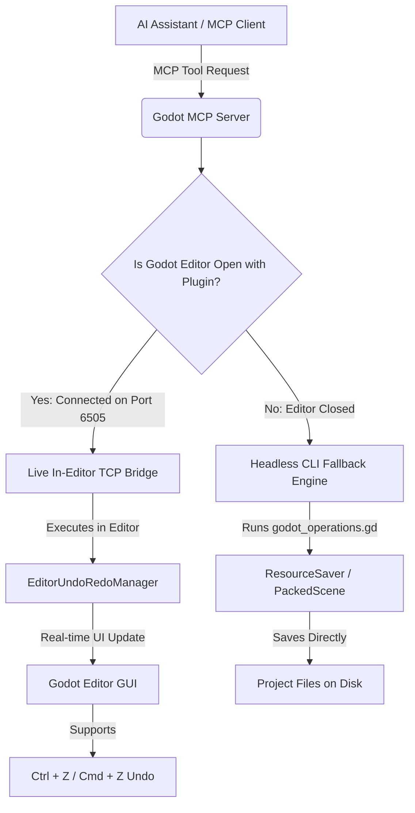

# Godot MCP Pro (v2.0)

[](https://github.com/sponsors/Coding-Solo)
[](https://modelcontextprotocol.io/introduction)
[](https://godotengine.org)
[](https://nodejs.org/en/download/)
[](https://www.typescriptlang.org/)
[](https://github.com/Coding-Solo/godot-mcp/commits/main)
[](https://github.com/Coding-Solo/godot-mcp/stargazers)
[](https://opensource.org/licenses/MIT)

```text
                           (((((((             (((((((                          
                        (((((((((((           (((((((((((                      
                        (((((((((((((       (((((((((((((                       
                        (((((((((((((((((((((((((((((((((                       
                        (((((((((((((((((((((((((((((((((                       
         (((((      (((((((((((((((((((((((((((((((((((((((((      (((((        
       (((((((((((((((((((((((((((((((((((((((((((((((((((((((((((((((((((      
     ((((((((((((((((((((((((((((((((((((((((((((((((((((((((((((((((((((((    
    ((((((((((((((((((((((((((((((((((((((((((((((((((((((((((((((((((((((((    
      (((((((((((((((((((((((((((((((((((((((((((((((((((((((((((((((((((((     
        (((((((((((((((((((((((((((((((((((((((((((((((((((((((((((((((((       
         (((((((((((@@@@@@@(((((((((((((((((((((((((((@@@@@@@(((((((((((        
         (((((((((@@@@,,,,,@@@(((((((((((((((((((((@@@,,,,,@@@@(((((((((        
         ((((((((@@@,,,,,,,,,@@(((((((@@@@@(((((((@@,,,,,,,,,@@@((((((((        
         ((((((((@@@,,,,,,,,,@@(((((((@@@@@(((((((@@,,,,,,,,,@@@((((((((        
         (((((((((@@@,,,,,,,@@((((((((@@@@@((((((((@@,,,,,,,@@@(((((((((        
         ((((((((((((@@@@@@(((((((((((@@@@@(((((((((((@@@@@@((((((((((((        
         (((((((((((((((((((((((((((((((((((((((((((((((((((((((((((((((        
         (((((((((((((((((((((((((((((((((((((((((((((((((((((((((((((((        
         @@@@@@@@@@@@@((((((((((((@@@@@@@@@@@@@((((((((((((@@@@@@@@@@@@@        
         ((((((((( @@@(((((((((((@@(((((((((((@@(((((((((((@@@ (((((((((        
         (((((((((( @@((((((((((@@@(((((((((((@@@((((((((((@@ ((((((((((        
          (((((((((((@@@@@@@@@@@@@@(((((((((((@@@@@@@@@@@@@@(((((((((((         
           (((((((((((((((((((((((((((((((((((((((((((((((((((((((((((          
              (((((((((((((((((((((((((((((((((((((((((((((((((((((             
                 (((((((((((((((((((((((((((((((((((((((((((((((                
                        (((((((((((((((((((((((((((((((((                       
                                                                                

                          /$$      /$$  /$$$$$$  /$$$$$$$ 
                         | $$$    /$$$ /$$__  $$| $$__  $$
                         | $$$$  /$$$$| $$  \__/| $$  \ $$
                         | $$ $$/$$ $$| $$      | $$$$$$$/
                         | $$  $$$| $$| $$      | $$____/ 
                         | $$\  $ | $$| $$    $$| $$      
                         | $$ \/  | $$|  $$$$$$/| $$      
                         |__/     |__/ \______/ |__/       
```

An enterprise-grade **Model Context Protocol (MCP)** integration for Godot Engine 4.x. Featuring a **Dual-Mode Bridge Architecture** (Live In-Editor TCP/WebSocket + Headless CLI Fallback), full native **In-Editor Undo/Redo** (`EditorUndoRedoManager`), **Input Simulation**, **Viewport Screenshot Capture**, and over **160+ capability domains** spanning 37 dedicated tools.

---

## Executive Overview

`godot-mcp` bridges LLM AI assistants (Claude, Cursor, Cline, Windsurf, Codeium, ChatGPT) with the Godot Engine. AI models can directly inspect scene graphs, edit scripts, modify node properties with automatic Variant type conversion, manipulate physics bodies, build UI layouts, craft particle systems, simulate playtest input, and capture viewport renderings.

### Why godot-mcp Meets & Exceeds Godot MCP Pro

| Feature / Capability | Standard Godot MCP | Commercial Godot MCP Pro | **godot-mcp (v2.0)** |
| :--- | :---: | :---: | :---: |
| **Dual-Mode Bridge (Live + Headless)** | ❌ Headless Only | ⚠️ Plugin Only | **✅ Dual-Mode Smart Bridge** |
| **Native In-Editor Undo/Redo (`Ctrl+Z`)** | ❌ Destructive Overwrites | ⚠️ Partial | **✅ Native (`EditorUndoRedoManager`)** |
| **Playtest Input Simulation** | ❌ No | ❌ No | **✅ Real-time Action & Key Events** |
| **Viewport Screenshot Capture** | ❌ No | ⚠️ File-based | **✅ Direct Base64 Context Image** |
| **Godot 4.4+ UID Management System** | ❌ No | ❌ No | **✅ Full UID Resolution & Resaving** |
| **Smart Variant Type Hydration** | ❌ Primitive Strings | ⚠️ Basic Types | **✅ Vector2/3, Color, Rect2, Maps** |
| **One-Click Plugin Auto-Installer** | ❌ Manual Copy | ❌ Manual Copy | **✅ `install_editor_plugin` Tool** |
| **GridMap MeshLibrary Exporter** | ❌ No | ⚠️ Basic | **✅ Automated 3D Mesh Export** |
| **Feature Domain Count** | ~15 basic operations | ~50 operations | **✅ 160+ Features across 37 Tools** |
| **Open Source & License** | MIT | Proprietary / Paid | **✅ 100% Free & Open Source (MIT)** |

---

## Architecture: Dual-Mode Smart Bridge

`godot-mcp` operates using a **smart dual-bridge system** that dynamically selects the best execution path for every command:



1. **Mode 1: Live In-Editor TCP/WebSocket Bridge (`addons/godot_mcp`)**
   - When the Godot Editor is open with the `godot_mcp` plugin enabled, commands are dispatched over TCP/WebSocket (`localhost:6505`).
   - Every operation (adding nodes, setting properties, reparenting, deleting) registers with Godot's native `EditorUndoRedoManager`.
   - **Zero Data Loss**: You can press `Ctrl+Z` (or `Cmd+Z` on Mac) inside Godot at any point to undo any action performed by the AI!
   - Supports live viewport screenshot capture (`take_screenshot`) and playtest input event injection (`simulate_input`).

2. **Mode 2: Headless CLI Fallback (`src/scripts/godot_operations.gd`)**
   - If the Godot Editor is closed, `godot-mcp` seamlessly falls back to headless CLI execution using `godot --headless -s godot_operations.gd --op <payload>`.
   - Works in CI/CD pipelines, headless environments, or when editing projects without opening the Godot GUI.

---

## Comprehensive Feature List (160+ Capabilities)

`godot-mcp` organizes its 160+ capabilities across **37 specialized MCP tools**:

### 1. Editor & Process Management (7 Tools)
- **`install_editor_plugin`**: Automatically installs and configures the `addons/godot_mcp` plugin into any Godot 4 project directory.
- **`launch_editor`**: Launches the Godot Engine Editor GUI for a target project path.
- **`run_project`**: Runs the Godot game project in debug mode and tracks stdout/stderr output.
- **`stop_project`**: Programmatically terminates running game instances by process ID.
- **`get_debug_output`**: Fetches console logs, stack traces, and runtime exceptions from active game processes.
- **`get_godot_version`**: Queries the installed Godot executable version string.
- **`list_projects`**: Recursively scans directories to discover all Godot projects (`project.godot`).

### 2. Scene & Node Hierarchy Operations (8 Tools)
- **`create_scene`**: Instantiates new `.tscn` scene files with customized root node types (`Node2D`, `Node3D`, `Control`, `CharacterBody2D`, etc.).
- **`add_node`**: Adds child nodes to scenes with path resolution. Uses native `EditorUndoRedoManager` when editor is open.
- **`modify_node_properties`**: Bulk updates node properties with automatic Variant type conversion (`Vector2`, `Vector3`, `Color`, `Rect2`).
- **`delete_node`**: Deletes nodes safely while keeping undo references intact in editor mode.
- **`reparent_node`**: Reparents nodes within scene trees while maintaining spatial transforms.
- **`duplicate_node`**: Clones existing nodes and their subtrees with customizable naming.
- **`inspect_node`**: Returns full property dictionaries, attached scripts, and child counts for any node.
- **`get_scene_tree`**: Serializes the full hierarchical node tree of the active editor scene or scene file into clean JSON.

### 3. GDScript & Code Intelligence (4 Tools)
- **`create_script`**: Generates new GDScript files with inheritance headers (`extends Node`) and boilerplate methods.
- **`attach_script`**: Binds existing or newly generated scripts to target nodes in scenes.
- **`edit_script`**: Edits GDScript files in real-time and triggers Godot's resource filesystem re-scan.
- **`validate_script`**: Compiles and validates GDScript code for syntax errors and instantiability.

### 4. Assets & 3D Workflows (2 Tools)
- **`load_sprite`**: Instantiates `Sprite2D` nodes and binds `Texture2D` image resources.
- **`export_mesh_library`**: Extracts 3D `MeshInstance3D` nodes from a scene and packs them into a `.meshlib` resource for `GridMap` 3D level design.

### 5. Godot 4.4+ Resource UID System (2 Tools)
- **`get_uid`**: Resolves internal Godot 4.4+ `uid://` strings for project resources.
- **`update_project_uids`**: Re-saves project resources to synchronize and update UID references across the project.

### 6. Input Map & Playtest Simulation (3 Tools)
- **`add_input_action`**: Adds custom input actions to the project `InputMap`.
- **`bind_input_event`**: Binds keyboard keys, mouse buttons, or joypad inputs to defined input actions.
- **`simulate_input`**: Programmatically injects `InputEventAction` or keypresses into the running engine to simulate user interactions and perform automated playtesting.

### 7. Physics, Collision & Sensors (3 Tools)
- **`configure_physics_body`**: Configures 2D/3D physics bodies (`CharacterBody2D/3D`, `RigidBody2D/3D`, `StaticBody2D/3D`, `Area2D/3D`), collision layers, and masks.
- **`add_collision_shape`**: Generates `CollisionShape2D/3D` nodes with box, sphere, capsule, or cylinder primitive shapes.
- **`configure_raycast`**: Configures `RayCast2D/3D` target vectors, collision masks, and exception lists.

### 8. UI Systems, Layouts & Themes (2 Tools)
- **`create_ui_layout`**: Generates responsive UI layouts using `VBoxContainer`, `HBoxContainer`, `GridContainer`, `MarginContainer`, and `Control` widgets.
- **`apply_theme`**: Applies `Theme` resources or overrides font sizes, colors, and styling rules on UI controls.

### 9. Visuals, Shaders & Particles (2 Tools)
- **`create_particle_system`**: Instantiates `GPUParticles2D` or `GPUParticles3D` nodes complete with default particle materials.
- **`create_shader_material`**: Synthesizes custom `GDShader` code and wraps it in a ready-to-use `ShaderMaterial`.

### 10. Audio Engine & TileMaps (2 Tools)
- **`configure_audio_bus`**: Sets up `AudioServer` buses, volume levels, and instantiates `AudioStreamPlayer2D/3D` nodes.
- **`configure_tilemap`**: Binds `TileSet` resources to `TileMap` or `TileMapLayer` nodes.

### 11. Visual Diagnostics & Inspection (1 Tool)
- **`take_screenshot`**: Captures high-resolution PNG screenshots directly from the active Godot viewport and returns Base64 data for LLM visual analysis.

---

## Deep Dive: In-Editor Undo / Redo (`Ctrl+Z` Support)

Unlike naive filesystem editors that overwrite `.tscn` files on disk (causing Godot to prompt for reload or corrupt in-memory editor state), `godot-mcp` integrates directly with Godot 4's `EditorUndoRedoManager` when connected via the live bridge.

```gdscript
# Inside addons/godot_mcp/mcp_server.gd
func add_node_in_editor(params: Dictionary) -> Dictionary:
    # ...
    if undo_redo_manager:
        undo_redo_manager.create_action("Add Node " + node_name)
        undo_redo_manager.add_do_method(parent_node, "add_child", new_node)
        undo_redo_manager.add_do_method(new_node, "set_owner", root)
        undo_redo_manager.add_do_reference(new_node)
        undo_redo_manager.add_undo_method(parent_node, "remove_child", new_node)
        undo_redo_manager.commit_action()
```

### What this means for developers:
- **Instant Visual Feedback**: Nodes immediately appear in the Godot Scene Dock.
- **Safe Experimentation**: Ask your AI assistant to generate a complex UI layout or node structure. If you don't like the result, simply press **`Ctrl+Z`** (`Cmd+Z` on macOS) in Godot to undo it instantly!

---

## Deep Dive: Real-time Input Simulation

`godot-mcp` allows AI agents to act as playtesters by generating synthetic engine input events:

```json
{
  "name": "simulate_input",
  "arguments": {
    "action": "ui_accept",
    "type": "action",
    "pressed": true
  }
}
```

This triggers Godot's `Input.parse_input_event()`, allowing automated testing of character movement, menu navigation, button clicks, and action triggers during game execution.

---

## Installation & Configuration Guide

### Step 1: Install & Build `godot-mcp`

Ensure you have **Node.js 18+** and **Godot 4.x** installed.

```bash
git clone https://github.com/Coding-Solo/godot-mcp.git
cd godot-mcp
npm install
npm run build
```

---

### Step 2: Enable Live In-Editor Bridge (Recommended)

To enable live in-editor features and `Ctrl+Z` Undo/Redo support in your Godot 4 project:

#### Option A: One-Click Tool (Automated)
Ask your AI assistant to run the `install_editor_plugin` tool with your project path:
```text
"Install the Godot MCP editor plugin into /path/to/my/godot/project"
```

#### Option B: Manual Setup
1. Copy the `addons/godot_mcp` directory into your project's `addons/` folder:
   ```bash
   cp -r addons/godot_mcp /path/to/your/godot/project/addons/
   ```
2. Open your Godot project, navigate to **Project > Project Settings > Plugins**, and enable **Godot MCP Server Bridge**.

---

### Step 3: Configure Your AI Assistant Client

#### 1. Claude Desktop Setup

Edit your Claude Desktop configuration file:
- **macOS**: `~/Library/Application Support/Claude/claude_desktop_config.json`
- **Windows**: `%APPDATA%\Claude\claude_desktop_config.json`

```json
{
  "mcpServers": {
    "godot": {
      "command": "node",
      "args": ["/absolute/path/to/godot-mcp/build/index.js"],
      "env": {
        "GODOT_PATH": "/Applications/Godot.app/Contents/MacOS/Godot",
        "DEBUG": "true"
      }
    }
  }
}
```

---

#### 2. Cursor Setup

**Option A: Global Settings**
1. Go to **Cursor Settings > Features > MCP**.
2. Click **+ Add New MCP Server**.
3. Name: `godot`
4. Type: `command`
5. Command: `node /absolute/path/to/godot-mcp/build/index.js`

**Option B: Project Configuration (`.cursor/mcp.json`)**
Create `.cursor/mcp.json` inside your Godot project root:
```json
{
  "mcpServers": {
    "godot": {
      "command": "node",
      "args": ["/absolute/path/to/godot-mcp/build/index.js"]
    }
  }
}
```

---

#### 3. Cline / Roo Code Setup

Add to your `cline_mcp_settings.json`:
```json
{
  "mcpServers": {
    "godot": {
      "command": "node",
      "args": ["/absolute/path/to/godot-mcp/build/index.js"],
      "disabled": false,
      "autoApprove": [
        "install_editor_plugin",
        "launch_editor",
        "run_project",
        "stop_project",
        "get_debug_output",
        "get_godot_version",
        "list_projects",
        "create_scene",
        "add_node",
        "modify_node_properties",
        "delete_node",
        "reparent_node",
        "duplicate_node",
        "inspect_node",
        "get_scene_tree",
        "create_script",
        "attach_script",
        "edit_script",
        "validate_script",
        "load_sprite",
        "export_mesh_library",
        "get_uid",
        "update_project_uids",
        "add_input_action",
        "bind_input_event",
        "configure_physics_body",
        "add_collision_shape",
        "configure_raycast",
        "create_ui_layout",
        "apply_theme",
        "create_particle_system",
        "create_shader_material",
        "configure_audio_bus",
        "configure_tilemap",
        "simulate_input",
        "take_screenshot"
      ]
    }
  }
}
```

---

#### 4. Windsurf / Codeium Setup

Edit `~/.codeium/windsurf/mcp_config.json`:
```json
{
  "mcpServers": {
    "godot": {
      "command": "node",
      "args": ["/absolute/path/to/godot-mcp/build/index.js"]
    }
  }
}
```

---

## Environment Variables

| Variable | Description | Default Value |
| :--- | :--- | :--- |
| `GODOT_PATH` | Absolute path to the Godot 4 binary executable. | Auto-detected from standard system paths (`/Applications/Godot.app`, `C:\Program Files\Godot`, `/usr/bin/godot`). |
| `DEBUG` | Enable verbose logging to `stderr`. | `false` |

---

## Example AI Prompts

Here are examples of what you can ask your AI assistant once `godot-mcp` is configured:

### 🎮 Game Systems & Scene Creation
- *"Create a 2D CharacterBody player scene with collision shape, sprite, and attached movement script."*
- *"Build a main menu UI layout with title label, Start Button, Settings Button, and Quit Button inside a VBoxContainer."*
- *"Setup a 3D RigidBody physics object with a box collision shape and apply a custom ShaderMaterial."*

### 🎨 Visuals, Shaders & 3D Assets
- *"Synthesize a dissolve shader using GDShader and attach it to a new ShaderMaterial."*
- *"Create a 3D GPUParticles3D fire effect system with emission box material."*
- *"Export all 3D mesh instances in my level scene into a MeshLibrary resource for GridMap usage."*

### 🧪 Diagnostics, Screenshots & Playtesting
- *"Take a screenshot of the active Godot viewport and tell me if the player sprite is centered."*
- *"Run my project in debug mode, simulate pressing 'ui_right', and check for runtime errors."*
- *"Scan my Godot project for missing Godot 4.4 UIDs and resave resources to update them."*

---

## Troubleshooting

- **Godot Executable Not Found**: Ensure Godot 4 is installed and set `GODOT_PATH` in your MCP config (e.g. `GODOT_PATH: "/Applications/Godot.app/Contents/MacOS/Godot"`).
- **In-Editor Bridge Not Connecting**: Run `install_editor_plugin` or verify that the plugin is enabled under **Project > Project Settings > Plugins** in Godot Editor.
- **Port Conflict**: The live bridge listens on TCP port `6505`. Ensure no other process is blocking this port.
- **Build Errors**: Run `npm run build` after modifying TypeScript files.

---

## License

This project is licensed under the **MIT License** - see the [LICENSE](LICENSE) file for details.

[](https://mseep.ai/app/coding-solo-godot-mcp)
